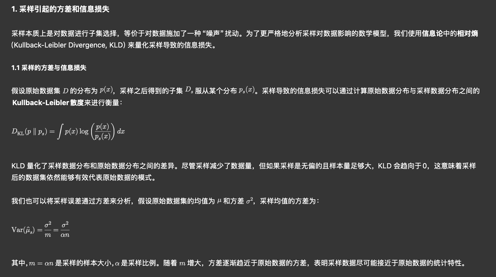
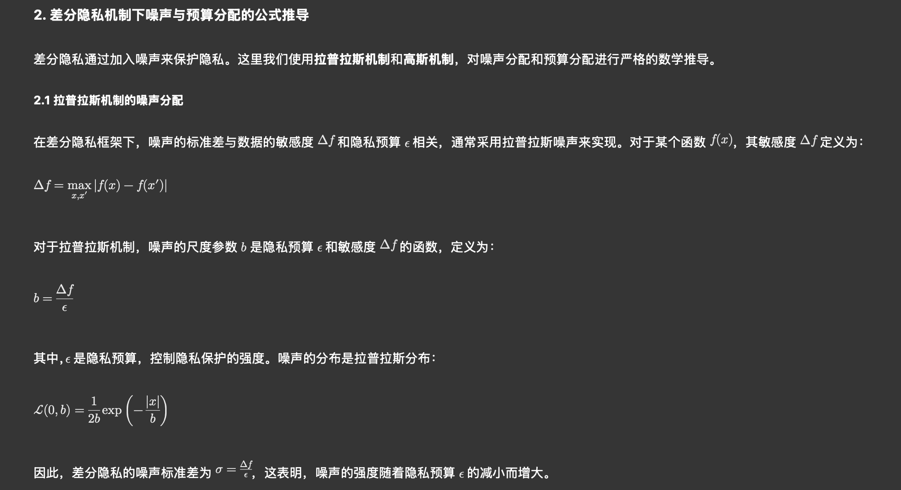
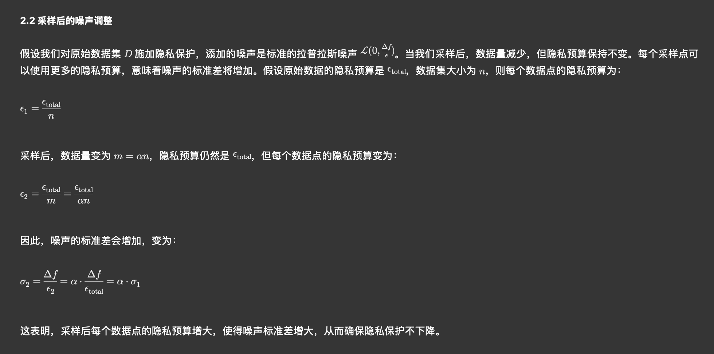
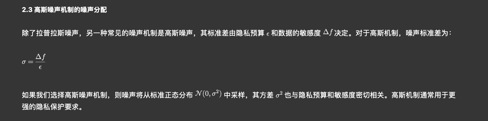
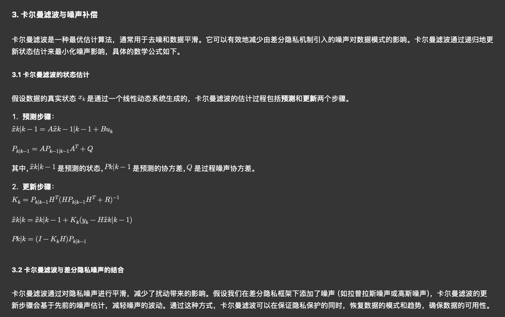

# myldp
差分隐私论文复现和小论文代码

1. 采样实际上是一种数据子集的选择，相当于对数据施加了“加噪”的操作。虽然采样会丢失部分数据，但大部分统计特性（如均值、方差等）可以得到保留。根据中心极限定理，当样本量足够大时，采样数据的均值和方差将趋近于原始数据的均值和方差。因此，在大样本条件下，采样后的数据集仍然能够有效代表原始数据的模式。这意味着采样后的数据集能够保留大部分原始数据的统计特性，从而确保数据的模式不会被完全破坏，采样数据仍然能够用于后续的分析和建模。
2. 采样减少了数据量，但仅仅通过采样不足以保证隐私保护，因为信息损失可能导致隐私泄露的风险。为了有效保护隐私，需要在数据中引入噪声，通常采用差分隐私机制。通过给数据添加噪声（如拉普拉斯噪声或高斯噪声），可以保证隐私保护的同时抑制信息泄露。具体来说，差分隐私机制依赖于隐私预算  \epsilon ，而噪声的大小与隐私预算和数据的敏感度有关。当采样数据时，我们可以根据剩余数据的隐私预算，增加噪声的强度，从而弥补因采样带来的隐私风险，确保数据的隐私保护。
3. 通过采样后虽然数据量减少了，在相同的隐私预算下，这样通过提高每个采样点的隐私预算，我们可以保证数据的隐私保护强度不降低。
4. 最后通过卡尔曼滤波帮助平滑数据，进一步减少噪声带来的影响，从而达到数据的可用性和隐私保护的平衡。

为了进行更高级的推导，我们将深入探讨以下几个方面，结合高级数学工具进行分析：

采样引起的方差和信息损失。
差分隐私机制下噪声与预算分配的公式推导。
卡尔曼滤波与隐私噪声的理论结合。

